# ***CS105 - Seminar***
# **Texture Và Chiếu Sáng**
## **Texture**
### **1. Giới thiệu**
Texture được dùng để thể hiện chi tiết bề mặt của một đối tượng như: màu sắc, sự gồ ghề,... Bất kỳ một bề mặt nào trong thực tế cũng có texture theo một tỉ lệ nhất định. Quá trình texture chính là sử dụng hình ảnh 2D để ánh xạ lên một đối tượng 3D thông qua một kỹ thuật gọi là UV Mapping (với UV là trục ngang, trục dọc của hình ảnh 2D).

### **2. Một số loại texture**
#### **Color Map**

Tất cả các đối tượng 3D mặc định được tạo ra đều có cùng một màu sắc và cường độ ánh sáng trên mọi điểm. Tuy nhiên, thực tế bề mặt đối tượng có thể có nhiều màu sắc khác nhau và những họa tiết phức tạp.

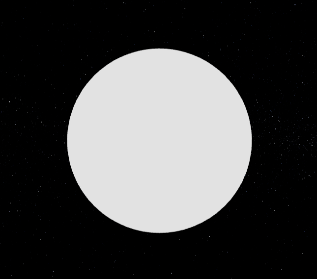

Để làm được điều đó, ta có thể sử dụng hình ảnh có sẵn (texture), kéo dãn tấm hình đó ra và áp lên material của đối tượng. Tuy nhiên, cách làm này chỉ thay đổi màu sắc bề mặt của đối tượng mà không thay đổi "địa hình" (lòi lõm, gồ ghề,...) của đối tượng.

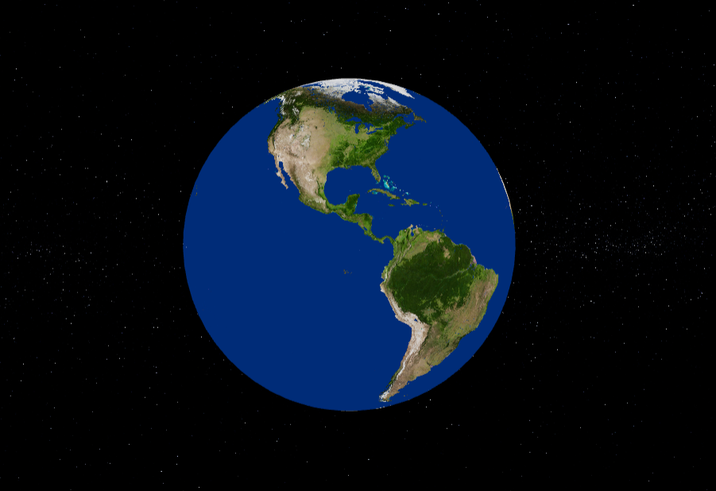

### **Bump Map**

Đây là thuộc tính có thể giải quyết được vấn đề của color map, đó chính là "địa hình" của đối tượng. Thông thường, bump map sẽ được lưu dưới dạng một hình ảnh trắng đen. Màu đen là nơi có độ cao lớn nhất và màu trắng sẽ có độ cao nhỏ nhất.

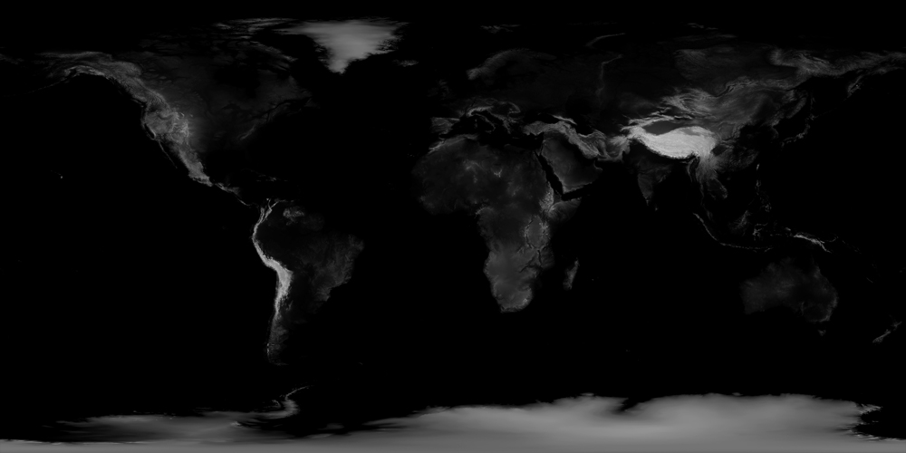
 
 Bump map không thực sự tác động đến mô hình, mà chỉ tác động đến ánh sáng để tạo ra hiệu ứng lòi lõm.

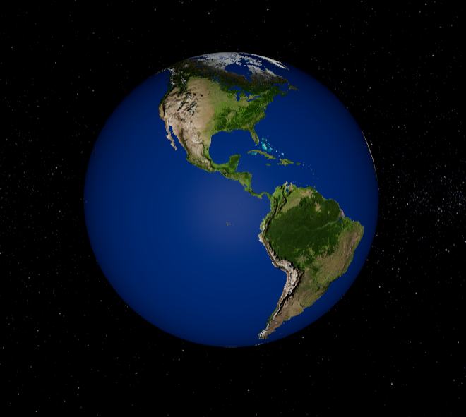

### **Displacement Map**

Khác với Bump map, Displacement map sẽ thay đổi cả hình dạng của cả đối tượng, vì thế, displacement map sẽ tốn tài nguyên máy tính khi sử dụng hơn.

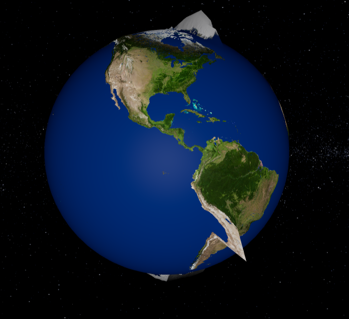

### **Specular Map**

Được dùng để thay đổi độ bóng của đối tượng. Trong trường hợp dưới đây, vùng màu trắng sẽ thể hiện độ phản xạ của Trái Đất ( vì thực tế chỉ có nước biển mới phản xạ được ánh sáng ).

Trước khi sử dụng Specular Map

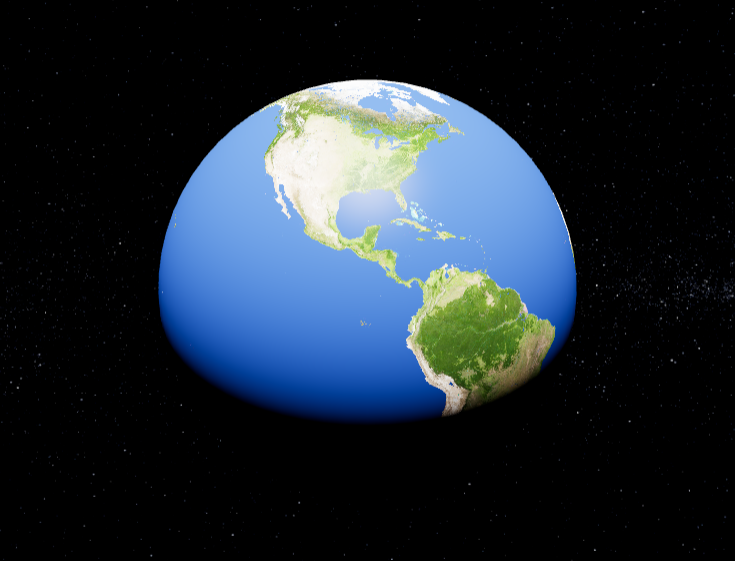

Sau khi áp Specular Map

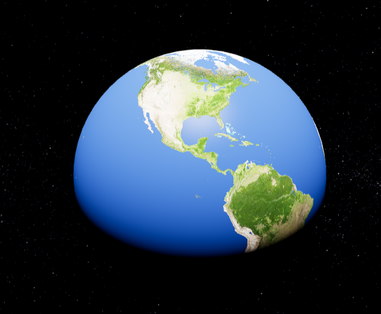

### **Alpha Map**

Alpha map được sử dụng để điều chỉnh độ trong suốt của một đối tượng. Nếu vị trí trên texture đó là màu đen, thì đối tượng sẽ trong suốt và ngược lại.

Sử dụng Alpha map với texture của Specular

### **Emissive Map**

Emissive Map có nhiệm vụ thể hiện màu sắc phần đối tượng không được chiếu sáng (tương tự như Emissive Color). Với ví dụ dưới đây, với nửa còn lại của Trái Đất không được mặt trời chiếu sáng, nếu không sử dụng Emissive Map phần đó sẽ mặc định phát xạ là màu đen. Ngược lại, khi sử dụng texture emissive, ta có thể custom lại phần đó là night light của Trái Đất.

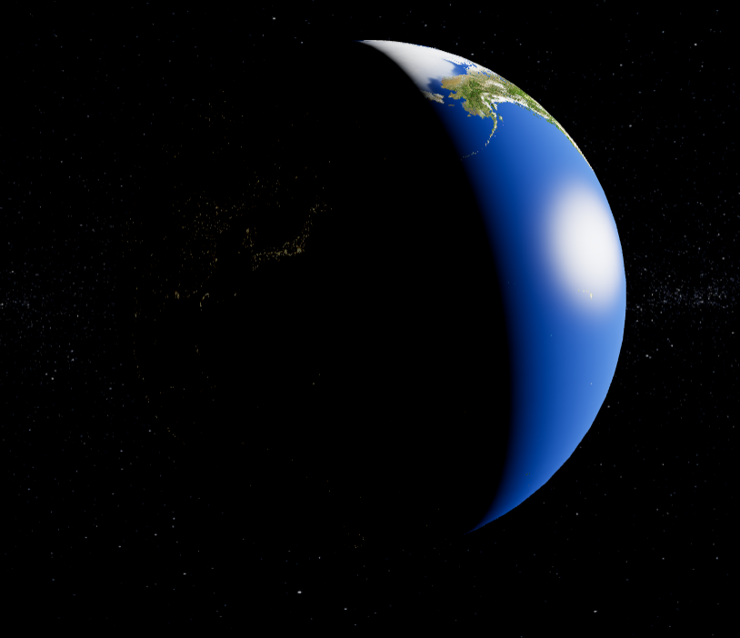

## **Chiếu Sáng**
### **1. Giới thiệu**

Trong thế giới thực, ánh sáng đóng vai trò rất quan trọng trong việc hiển thị một đối tượng. Ánh sáng mặt trời, ánh sáng bóng đèn,.... Với mỗi loại ánh sáng khác nhau sẽ tác động đến vật thể khác nhau.

### **2. Phân loại ánh sáng**
### **AmbientLight**

Đây là kiểu ánh sáng cơ bản nhất trong đồ họa. Với kiểu chiếu sáng này, màu sắc sẽ được áp dụng cho toàn bố cục kể cả hình dạng vật thể. Tia sáng sẽ không có hướng và cường độ ánh sáng sẽ như nhau không tính khoảng cách xa gần của vật thể.

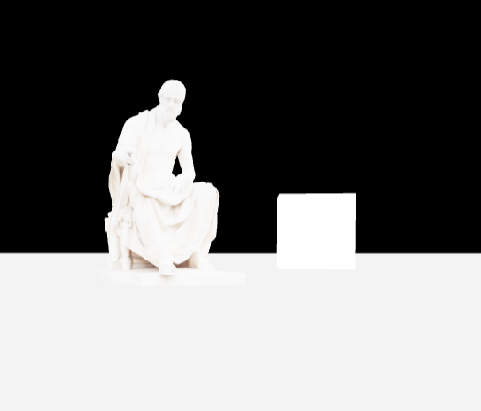

Thông thường, ta không sử dụng riêng rẽ AmbientLight mà sẽ kết hợp với các loại ánh sáng khác để mang lại hiệu ứng đẹp hơn cho vật thể.

### **DirectionalLight**

Đây là ánh sáng được phát ra theo một hướng cụ thể. Ánh sáng này sẽ từ rất xa và các tia sáng của nó sẽ song song nhau. Thông thường, ta dùng ánh sáng này để mô phỏng ánh sáng ban ngày vì mặt trời được đặt ở vị trí đủ xa và tất cả tia sáng của mặt trời cũng là song song.

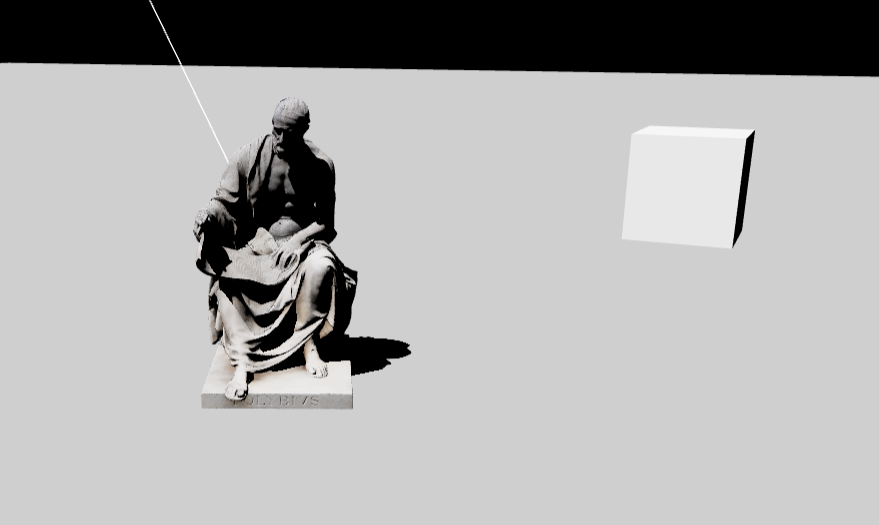

Ta có thể thấy rõ sự khác biệt với Ambient, ánh sáng trực tiếp có thể tạo bóng cho vật thể, tuy nhiên DirectionalLight cũng chỉ cung cấp một cường độ sáng duy nhất cho toàn bố cục bất kể xa gần của các vật thể.

### **HemisphereLight**

Đây là nguồn sáng được đặt ngay phía trên cảnh, với màu sắc nhạt dần từ bầu trời sang mặt đất. Tác dụng của nguồn sáng này là giúp cho các vật ngoại cảnh trông thật hơn. Màu của một điểm trên đối tượng sẽ được nhân với màu từ bầu trời nếu vector pháp tuyến tại điểm đó hướng lên trên; màu sẽ được nhân với màu từ mặt đất nếu vector pháp tuyến hướng xuống dưới.

Với ví dụ dưới đây, ta sử dụng skycolor là màu vàng và groundcolor là màu hồng.

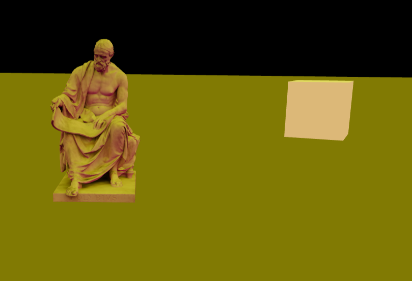

Do vector pháp tuyến của mặt phẳng hướng lên trên ( có thể kiểm tra bằng VertexNormalsHelper ), nên mặt trên của mặt phẳng mang color của sky.

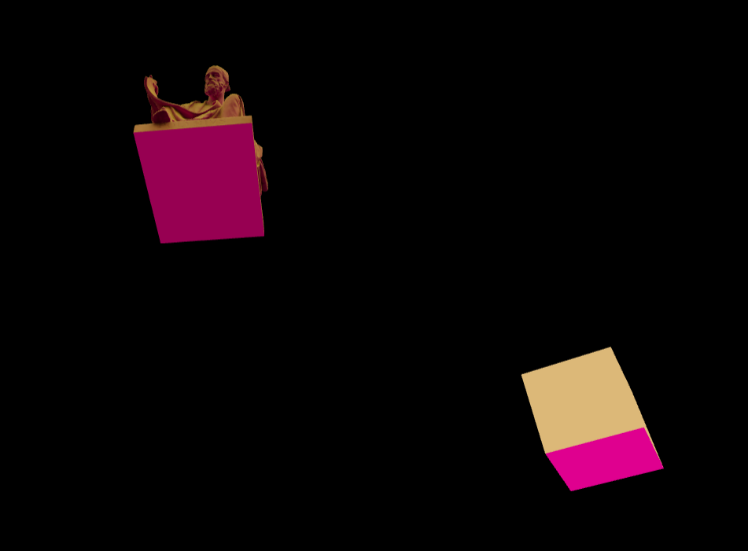

Ngược lại, phía bên dưới sẽ mang color của ground.

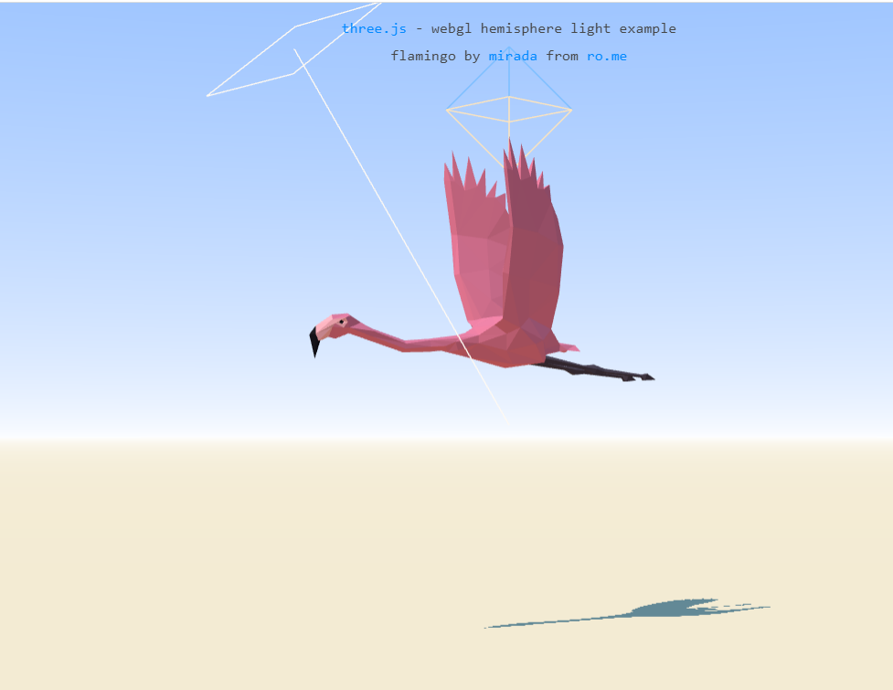

Khi sử dụng HemisphereLight đúng cách sẽ cho ra ngoại cảnh rất chân thật như ví dụ trên đây (https://threejs.org/examples/?q=Hem#webgl_lights_hemisphere). 

### **PointLight**

Đây là nguồn sáng mà tất cả các tia sáng tỏa ra từ 1 điểm nhất định trong không gian (bóng đèn,...)

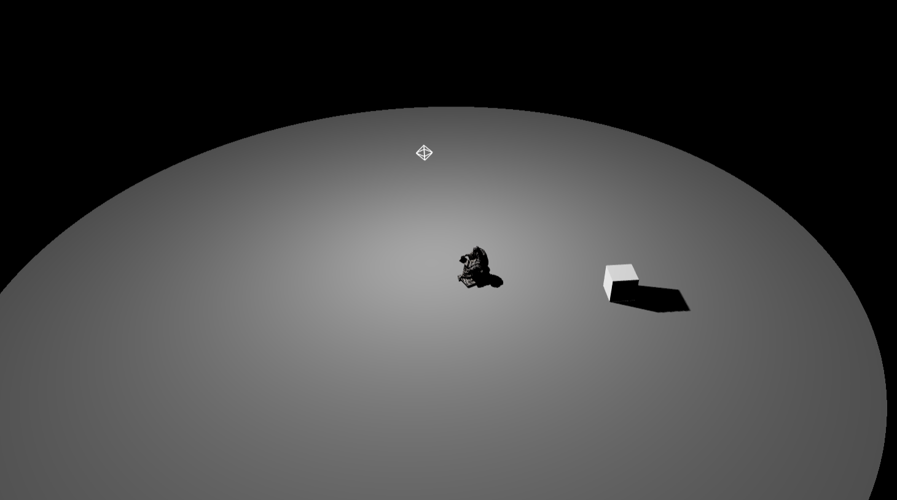

Threejs hỗ trợ rất nhiều thuộc tính cho PointLight như: tạo bóng, năng lượng của nguồn sáng, mức độ mờ của ánh sáng dọc theo khoảng cách của ánh sáng,...

### **SpotLight**

Đây là nguồn sáng có dạng đèn chụp. Ánh sáng sẽ được phát ra theo một hướng duy nhất và dọc theo hình nón có kích thước tăng dần khi ánh sáng càng xa.

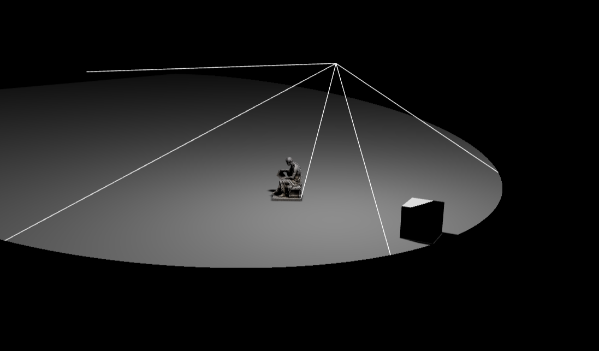

Ngoài các thuộc tính cơ bản như góc ánh sáng, khoảng cách, vùng nửa tối,... Ở các bản cập nhật gần đây, Threejs đã cập nhật tính năng texture cho spotlight. Nghĩa là, ta có thể tạo quyết định được "họa tiết" của ánh sáng.

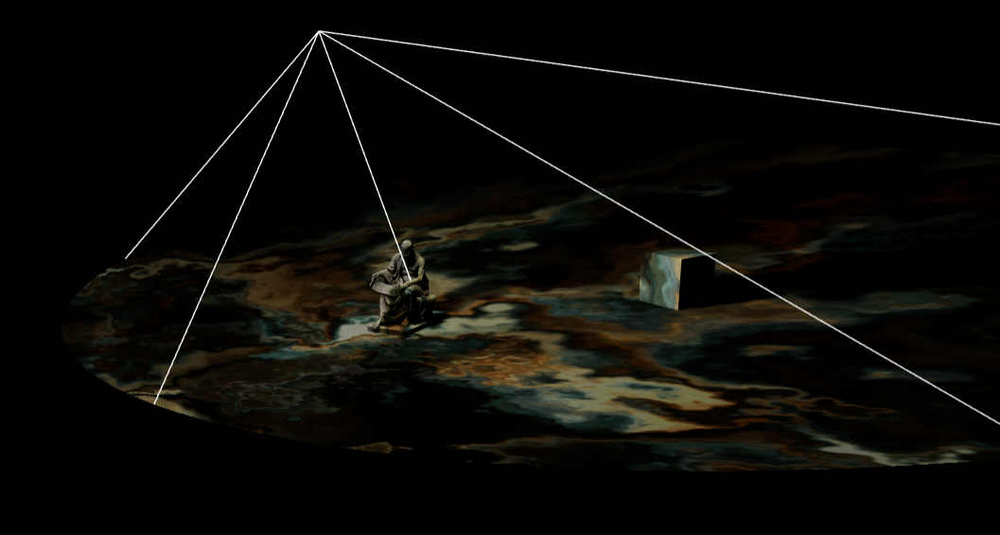

### **RectAreaLight**

Đây là nguồn sáng sẽ tỏa ánh sáng đồng đều trên một mặt phẳng hình chữ nhật. Loại ánh sáng này có thể được sử dụng để mô phỏng các nguồn ánh sáng như cửa sổ sáng hoặc dải ánh sáng.

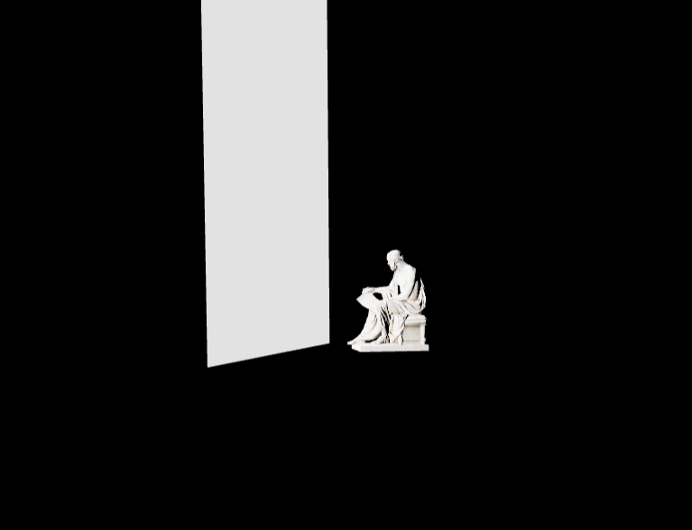

Tuy nhiên, việc sử dụng RectAreaLight còn khá hạn chế trong Threejs. Loại ánh sáng này chưa được hỗ trợ đổ bóng và chỉ có thể áp dụng trên một số material nhất định.

    
