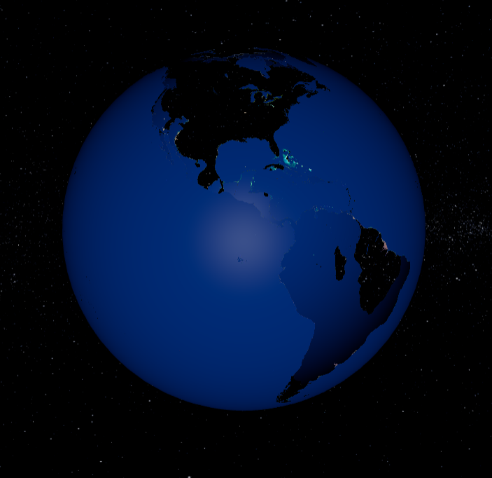

# ***CS105 - Seminar***
# **Texture Và Chiếu Sáng**
## **Texture**
### **1. Giới thiệu**
Texture được dùng để thể hiện chi tiết bề mặt của một đối tượng như: màu sắc, sự gồ ghề,... Bất kỳ một bề mặt nào trong thực tế cũng có texture theo một tỉ lệ nhất định. Quá trình texture chính là sử dụng hình ảnh 2D để ánh xạ lên một đối tượng 3D thông qua một kỹ thuật gọi là UV Mapping (với UV là trục ngang, trục dọc của hình ảnh 2D).

### **2. Một số loại texture**
#### **Color Map**

Tất cả các đối tượng 3D mặc định được tạo ra đều có cùng một màu sắc và cường độ ánh sáng trên mọi điểm. Tuy nhiên, thực tế bề mặt đối tượng có thể có nhiều màu sắc khác nhau và những họa tiết phức tạp.

Để làm được điều đó, ta có thể sử dụng hình ảnh có sẵn (texture), kéo dãn tấm hình đó ra và áp lên material của đối tượng. Tuy nhiên, cách làm này chỉ thay đổi màu sắc bề mặt của đối tượng mà không thay đổi "địa hình" (lòi lõm, gồ ghề,...) của đối tượng.

### **Bump Map**

Đây là thuộc tính có thể giải quyết được vấn đề của color map, đó chính là "địa hình" của đối tượng. Thông thường, bump map sẽ được lưu dưới dạng một hình ảnh trắng đen. Màu đen là nơi có độ cao lớn nhất và màu trắng sẽ có độ cao nhỏ nhất.

 
 Bump map không thực sự tác động đến mô hình, mà chỉ tác động đến ánh sáng để tạo ra hiệu ứng lòi lõm.

### **Displacement Map**

Khác với Bump map, Displacement map sẽ thay đổi cả hình dạng của cả đối tượng, vì thế, displacement map sẽ tốn tài nguyên máy tính khi sử dụng hơn.

### **Specular Map**

Được dùng để thay đổi độ bóng của đối tượng. Trong trường hợp dưới đây, vùng màu trắng sẽ thể hiện độ phản xạ của Trái Đất ( vì thực tế chỉ có nước biển mới phản xạ được ánh sáng ).

Trước khi sử dụng Specular Map

Sau khi áp Specular Map

### **Alpha Map**

Alpha map được sử dụng để điều chỉnh độ trong suốt của một đối tượng. Nếu vị trí trên texture đó là màu đen, thì đối tượng sẽ trong suốt và ngược lại.

Sử dụng Alpha map với texture của Specular

### **Emissive Map**

Emissive Map có nhiệm vụ thể hiện màu sắc phần đối tượng không được chiếu sáng (tương tự như Emissive Color). Với ví dụ dưới đây, với nửa còn lại của Trái Đất không được mặt trời chiếu sáng, nếu không sử dụng Emissive Map phần đó sẽ mặc định phát xạ là màu đen. Ngược lại, khi sử dụng texture emissive, ta có thể custom lại phần đó là night light của Trái Đất.

